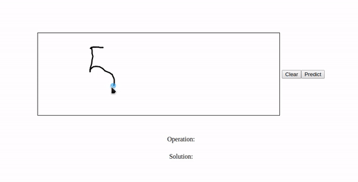

# Handwritten-Equation-Recognition---CNN

A WebApp for Solve Handwritten Equations using Convolutional Neural Networks

It works with any digit from 0-9 and the symbols +,-,x

> White blackground and black digits are necessary



## Convolutional Neural Network
* Two Convolutional Layers
* Two MaxPooling Layers
* Dropout Layer
* Flatten Layer
* Two Dense Layers using Relu
* Output Layer using Softmax
* Adam Optimizer

## Installation

1. Create a virtual environment:
```bash
python -m venv venv
```

2. Activate the virtual environment:

    * On Linux
    ```bash
    . venv/bin/activate
    ```

    * On Windows
    ```bash
    venv\Scripts\activate
    ```

3. Install the dependencies
```
pip install -r requirements.txt
```

## Usage

In the folder model, there is a pre-build model of the neural network and the weights of that model.
But if you wanna build or train in your own hands, you need to create a folder called 'datasets' in the root of the project, download the datasets from *[here](https://www.kaggle.com/xainano/handwrittenmathsymbols)* and extract the folders '0, 1, 2, 3, 4 ,5, 6, 7, 8, 9, +, -, times (rename the folder for x)' in the folder

After that you are ready to start the application. For that is just:
```bash
python -m flask run --without-threads
```

## Used Technologies
* TensorFlow / Keras
* Python / Flask
* OpenCv
* P5.js

## Authors

* **Matheus Cunha Reis** - [GitHub](https://github.com/matheuscr30) ✌
* **João Daniel Rufino** - [GitHub](https://github.com/JoaoDanielRufino)
* **Pedro Henrique Teixeira** - [GitHub](https://github.com/pedroteixeirazup)

## License
[MIT](https://choosealicense.com/licenses/mit/)
